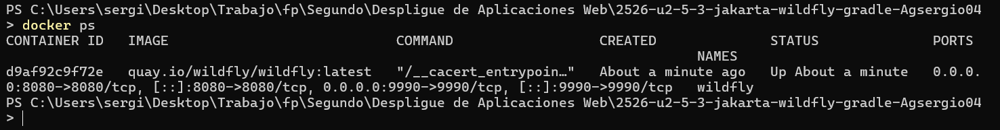
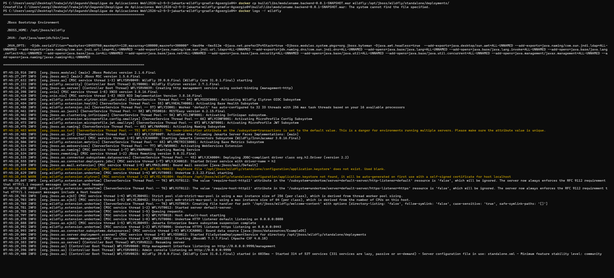
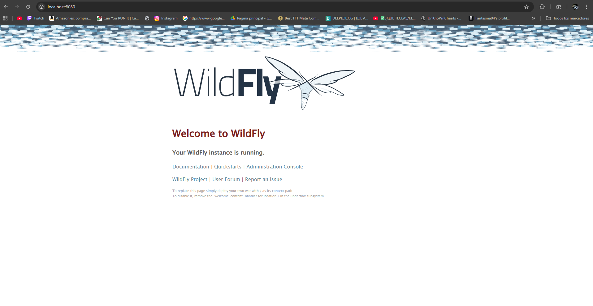
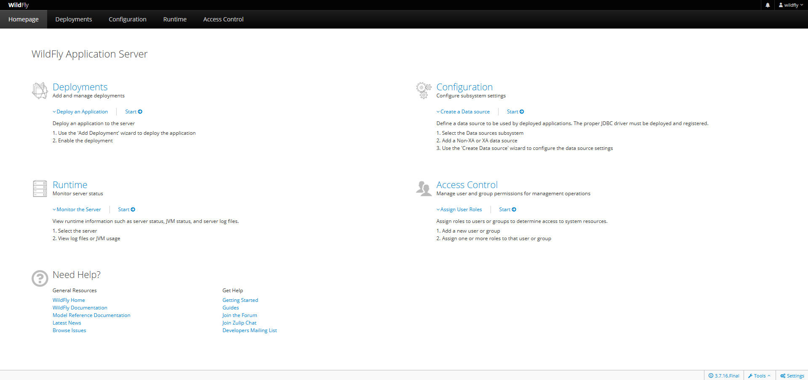
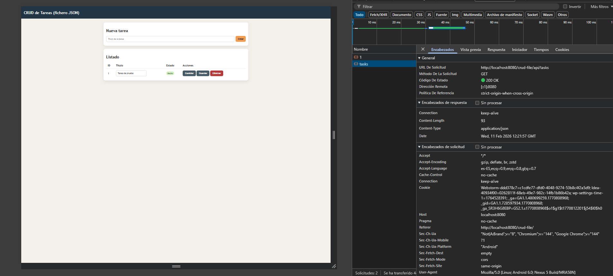
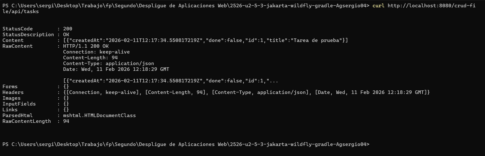
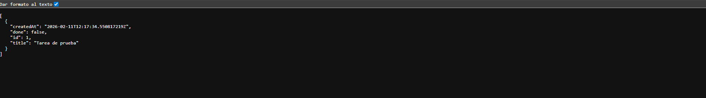
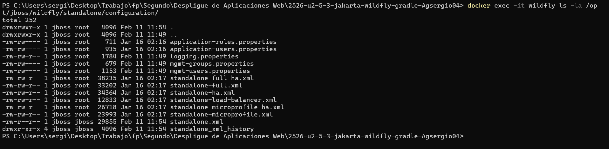
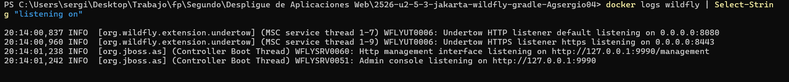
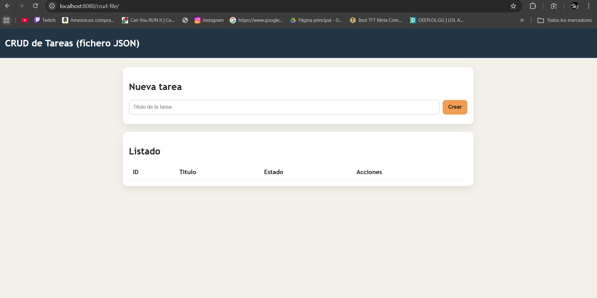

# Informe de la practica P5.2

Aqui dejo las imagenes de la realizacion de la pracitca 5.2: 

- ****

- ****

- ****

- ****

- ****

- ****

- ****

#  Informe de la practica P5.3 

- **a) Componentes y funcionamiento de los servicios del servidor**

En mi despliegue de P5.2 intervienen los siguientes componentes:

| Componente | Función | Puerto | Estado |
|-----------|---------|--------|--------|
| **Docker** | Motor de contenedores, aisla WildFly en un entorno reproducible | - | Anfitrión |
| **Contenedor WildFly** | Servidor de aplicaciones Jakarta EE, ejecuta el WAR | 8080, 9990 | Dentro de Docker |
| **WAR (crud-file.war)** | Artefacto compilado que contiene la API REST con clases Java | - | Desplegado en WildFly |
| **Puerto 8080** | Servidor web (Undertow) que recibe peticiones HTTP de clientes | 8080 | Publicado en host |
| **Puerto 9990** | Consola de administración de WildFly | 9990 | Publicado en host |
| **Endpoint REST** | `@GET /tasks/list`, `@POST /tasks/new`, etc. (clases TaskResource.java) | 8080 | Dentro de WildFly |

##### Flujo de una petición cliente → endpoint

El flujo de una peticion  es el siguiente : 

1. Cliente (navegador/curl) : HTTP GET http://localhost:8080/crud-file/tasks/list
2. Docker expone puerto 8080  (Contenedor WildFly )
3. Undertow (servidor web de WildFly) recibe en :8080
4. Busca contexto /crud-file  (Encuentra WAR desplegado)
5. Routing JAX-RS: /tasks/list  (Clase TaskResource.java)
6. Método @GET /list ejecuta lógica
7. Lee datos de FileTaskStore.java (almacenamiento en archivo)
8. Serializa a JSON → Devuelve al cliente
Respuesta: HTTP 200 + JSON con lista de tareas


```bash
docker ps 
```


```bash
docker logs -f wildfly
```


Prueba de endpoint (curl):

```bash
curl -s http://localhost:8080/crud-file/tasks/list | jq
```


- **b) Archivos principales de configuración y bibliotecas compartidas**

**Archivos de configuración principales en WildFly**

- Ubicación: `/opt/jboss/wildfly/standalone/configuration/`

```
docker exec -it wildfly ls -la /opt/jboss/wildfly/standalone/configuration/
```

Captura de lo optenido: 




Archivo principal: `standalone.xml`

Este es el fichero maestro que gobierna toda la configuración del servidor WildFly en modo "standalone" (instancia única). En mi despliegue, actualmente mi contenedor ejecuta con `standalone.xml`.

Dependiendo de las necesidades de mi aplicación, podría modificar estos aspectos:

| Aspecto | Ubicación en XML | Ejemplo de cambio | Para qué |
|--------|------------------|------------------|---------|
| **Base de Datos (Datasources)** | `<subsystem xmlns="urn:jboss:domain:datasources:...">` | Añadir `<datasource>` con credenciales MySQL/PostgreSQL | Conectar la app a una BD real |
| **Puertos e Interfaces** | `<socket-binding-group>` | Cambiar puerto 8080 a 8081 o vincular a IP específica | Evitar conflictos de puerto o exponer solo en red interna |
| **Logs y Debugging** | `<subsystem xmlns="urn:jboss:domain:logging:...">` | Cambiar nivel de `<level name="INFO"/>` a `DEBUG` | Ver trazas SQL o errores detallados |
| **Seguridad (Security Domains)** | `<subsystem xmlns="urn:jboss:domain:elytron:...">` | Añadir realms y mapeos de usuarios | Implementar autenticación con LDAP o Active Directory |
| **Colas de Mensajería (JMS)** | `<subsystem xmlns="urn:jboss:domain:messaging-activemq:...">` | Crear `<jms-queue>` o `<jms-topic>` | Messaging asíncronos entre aplicaciones |
| **Tamaño de uploads (Undertow)** | `<subsystem xmlns="urn:wildfly:undertow:...">` | Aumentar `max-post-size` | Permitir subida de archivos > 10MB |

##### 3. **Dependencias "provided" en el proyecto**

En el archivo **`build.gradle`**, tengo la siguiente configuración:

```gradle
dependencies {
    compileOnly 'jakarta.platform:jakarta.jakartaee-api:10.0.0'
}

plugins {
    java
    war
}
```

¿Qué significa "provided" o "compileOnly"?

Significa que esta dependencia es necesaria solo en tiempo de copilacion,sin incluirse en el .war ya que WildFly proporciona todas las bibliotecas en su classpath.

- Siendo estas las siguientes ventajas : 
    - Evita conflictos de versiones
    - Reduce el tamañao del .war 
    - Garantiza compatibilidad
    - simplifica actualizaciones


Contenido actual del `build.gradle.kts` de mi proyecto:

```gradle
plugins {
    id 'java'
    id 'war'
}

group = 'com.example'
version = '1.0.0'

def javaVersion = JavaVersion.VERSION_17

java {
    sourceCompatibility = javaVersion
    targetCompatibility = javaVersion
}

repositories {
    mavenCentral()
}

dependencies {
    compileOnly 'jakarta.platform:jakarta.jakartaee-api:10.0.0'
}

war {
    archiveFileName = 'crud-file.war'
}

tasks.withType(JavaCompile).configureEach {
    options.encoding = 'UTF-8'
}

```


- **c) Cooperación con el servidor web (proxy / reverse proxy) y https**

Un reverse proxy es un servidor web intermedio que:
- Recibe las peticiones HTTP/HTTPS de los clientes
- Las redirecciona al servidor backend (WildFly) 
- Devuelve la respuesta al cliente


- Ventajas en producción:

    - Seguridad: WildFly no está expuesto a Internet. Los accesos van por Nginx.
    - Cifrado: HTTPS entre cliente y Nginx, HTTP interno entre Nginx y WildFly.
    - Ocultamiento: El cliente no sabe que hay WildFly detrás. No expone versiones o detalles.
    - Control de acceso: Puedo bloquear IPs, limitar rate, filtrar peticiones.
    - Escalabilidad: Un Nginx puede distribuir carga entre múltiples WildFlys.

Diferencia: Mi despliegue actual vs. Con Reverse Proxy


```
docker run -d --name wildfly -p 8080:8080 -p 9990:9990 quay.io/wildfly/wildfly:latest
```

URLs accesibles:
- API: `http://localhost:8080/crud-file/...`
- Admin: `http://localhost:9990` (console del servidor visible)

Problemas:
-  La consola de administración (9990) está accesible públicamente
-  Tráfico en HTTP plano (sin cifrar)
-  El cliente ve directamente que es WildFly versi X.X.X
-  Cualquiera con acceso a la red puede intentar entrar en la admin

---

Despliegue mejorado (con Nginx + HTTPS):

```
docker run -d --name wildfly \
  -p 8080:8080 \   ← SOLO localhost (no publicado hacia afuera)
  quay.io/wildfly/wildfly:latest \
  /opt/jboss/wildfly/bin/standalone.sh -b 127.0.0.1 -bmanagement 127.0.0.1

docker run -d --name nginx \
  -p 80:80 \       ← HTTP redirige a HTTPS
  -p 443:443 \     ← HTTPS es lo que ve el cliente
  -v /path/to/nginx.conf:/etc/nginx/nginx.conf \
  -v /path/to/certs:/etc/nginx/certs \
  nginx:latest
```

URLs accesibles:
- API: `https://api.ejemplo.com/api/tasks/...`
- Admin: no es accesible (bloqueada en Nginx).

Beneficios:
-  Admin SOLO accesible desde red privada
-  Tráfico cifrado (TLS 1.2 / 1.3)
-  Cliente solo ve Nginx, no WildFly
-  Ruta clara `/api/` para la aplicación

Configuración de Nginx como Reverse Proxy 

Archivo ubicando en `/etc/nginx/nginx.conf` y este es su contendio : 

```nginx
# Upstream: Define dónde está WildFly
upstream wildfly_backend {
    server wildfly:8080;  # Dentro de Docker, usa nombre del contenedor
    # Para afuera de Docker: server localhost:8080;
}

server {
    listen 80;
    listen [::]:80;
    server_name api.ejemplo.com;

    # Redirigir TODO el tráfico HTTP a HTTPS
    return 301 https://$server_name$request_uri;
}

server {
    listen 443 ssl http2;
    listen [::]:443 ssl http2;
    server_name api.ejemplo.com;

    # ---- Certificados SSL/TLS ----
    ssl_certificate /etc/nginx/certs/certificado.crt;
    ssl_certificate_key /etc/nginx/certs/clave.key;
    
    # Opcional: Si usas Let's Encrypt con cadena completa:
    # ssl_trusted_certificate /etc/nginx/certs/chain.pem;

    # ---- Configuración de seguridad SSL ----
    ssl_protocols TLSv1.2 TLSv1.3;
    ssl_prefer_server_ciphers on;
    ssl_ciphers 'ECDHE-ECDSA-AES128-GCM-SHA256:ECDHE-RSA-AES128-GCM-SHA256';
    ssl_session_cache shared:SSL:10m;
    ssl_session_timeout 10m;

    # HSTS: Fuerza HTTPS en futuras visitas (6 meses)
    add_header Strict-Transport-Security "max-age=31536000; includeSubDomains" always;

    # ---- Logs ----
    access_log /var/log/nginx/access.log;
    error_log /var/log/nginx/error.log;

    # ---- Ubicación: API REST ----
    location /api/ {
        proxy_pass http://wildfly_backend/crud-file/;
        
        # Headers necesarios para que WildFly sepa el contexto real
        proxy_set_header Host $host;
        proxy_set_header X-Real-IP $remote_addr;
        proxy_set_header X-Forwarded-For $proxy_add_x_forwarded_for;
        proxy_set_header X-Forwarded-Proto $scheme;
        proxy_set_header X-Forwarded-Host $server_name;
        
        # Timeouts
        proxy_connect_timeout 60s;
        proxy_send_timeout 60s;
        proxy_read_timeout 60s;
        
        # Buffering
        proxy_buffering on;
        proxy_buffer_size 4k;
        proxy_buffers 8 4k;
    }

    # ---- Ubicación: BLOQUEAR admin ----
    location ~ ^/(admin-console|management|jboss-cli) {
        deny all;
        return 403;
    }

    # ---- Health check (opcional) ----
    location /health {
        proxy_pass http://wildfly_backend/crud-file/tasks/hello;
        access_log off;
    }

    # ---- Raíz: Redirigir a /api/ ----
    location / {
        return 301 https://$server_name/api/;
    }
}
```

Antes (directo a WildFly):
```
http://localhost:8080/crud-file/tasks/list                    
```

Con Nginx
```
https://api.ejemplo.com/api/tasks/list
                        ↑ Ruta limpia, independiente del nombre del WAR
```

¿Cómo funciona?

```nginx
location /api/ {
    proxy_pass http://wildfly_backend/crud-file/;
}
```

- Cliente pide: `https://api.ejemplo.com/api/tasks/list`
- Nginx traduce a: `http://wildfly:8080/crud-file/tasks/list`
- WildFly responde
- Nginx devuelve al cliente como si viniera de `/api/`

Ventaja: Si en el futuro renombro el WAR a `backend-v2.war`, solo cambio una línea en Nginx. El cliente sigue usando `/api/`.

Seguridad: No exponemos el puerto 9990

En el `docker run` de WildFly:

```bash
# SIN publicar 9990:
docker run -d --name wildfly \
  -p 127.0.0.1:8080:8080 \  ← Solo accesible desde localhost
  quay.io/wildfly/wildfly:latest \
  /opt/jboss/wildfly/bin/standalone.sh \
    -b 127.0.0.1 \            ← WildFly escucha en 127.0.0.1 (local)
    -bmanagement 127.0.0.0    ← Admin TAMBIÉN solo en local
```

En Nginx, bloqueamos cualquier acceso a admin:

```nginx
location ~ ^/(admin-console|management|jboss-cli) {
    deny all;
    return 403;
}
```

Así, aunque alguien intente acceder a `/admin-console`, Nginx devuelve 403 Forbidden.

Consecuencia:
-  La consola no es accesible desde Internet
-  La consola si es accesible desde dentro de la red privada (se puede acceder directamente a `localhost:9990` para administrar)

TLS/HTTPS: ¿Qué es y qué ventajas aporta?

TLS (Transport Layer Security) es el protocolo que cifra la comunicación entre cliente y servidor.

Ventajas de HTTPS en producción:

| Aspecto | Beneficio |
|---------|-----------|
| **Confidencialidad** | Las contraseñas, tokens, datos no se ven en la red |
| **Integridad** | Nadie puede modificar los datos en tránsito |
| **Autenticación** | El certificado prueba que es el servidor real (no un falso) |
| **Cumplimiento legal** | GDPR, PCI-DSS y otros estándares **requieren** HTTPS |
| **SEO** | Google premia a sitios HTTPS en búsquedas |
| **Confianza** | El cliente ve un candadito  en el navegador |

¿Cambiaría algo en WildFly o en la aplicación?

1. El código de la aplicación :
   - Sigue igual
   - No necesita cambios
   - Las anotaciones `@GET`, `@POST`, etc. siguen funcionando igual

2. La configuración de WildFly:
   - El `standalone.xml` PODRÍA tener cambios, pero no obligatorios:
     - Podrías habilitar HTTPS directamente en WildFly (pero innecesario si Nginx ya lo hace)
     - Podrías cambiar los puertos que escucha (ej. solo en 127.0.0.1), cosa que SÍ recomiendo

3. El WAR:
   - Mismo WAR (`crud-file.war`)
   - Mismo contenido
   - No cambia

Lo que SÍ cambia es el Docker Compose/comandos:

Antes (desarrollo):
```bash
docker run -d --name wildfly \
  -p 8080:8080 \
  -p 9990:9990 \
  quay.io/wildfly/wildfly:latest
```

Después (producción):
```bash
# WildFly: Cerrado, solo localhost
docker run -d --name wildfly \
  --network tutred \
  -e JAVA_OPTS="-Djboss.bind.address=127.0.0.1" \
  quay.io/wildfly/wildfly:latest \
  /opt/jboss/wildfly/bin/standalone.sh -b 127.0.0.1 -bmanagement 127.0.0.1

# Nginx: El único expuesto a Internet
docker run -d --name nginx \
  --network tutred \
  -p 80:80 \
  -p 443:443 \
  -v $(pwd)/nginx.conf:/etc/nginx/nginx.conf:ro \
  -v $(pwd)/certs:/etc/nginx/certs:ro \
  nginx:latest
```


Configuración de certificados TLS

Para desarrollo/pruebas:

```bash
# Generar clave privada
openssl genrsa -out clave.key 2048

# Generar certificado auto-firmado (válido 365 días)
openssl req -new -x509 -key clave.key -out certificado.crt -days 365 \
  -subj "/C=ES/ST=Madrid/L=Madrid/O=MiEmpresa/CN=api.ejemplo.com"

# Copiar a la carpeta de certs
mkdir -p certs
cp certificado.crt clave.key certs/
```

```bash
# Instalar Certbot
sudo apt install certbot python3-certbot-nginx

# Generar certificado (automático con Nginx)
sudo certbot certonly --nginx -d api.ejemplo.com -d ejemplo.com

# Los certificados están en: /etc/letsencrypt/live/api.ejemplo.com/
# Configurar Nginx con:
# ssl_certificate /etc/letsencrypt/live/api.ejemplo.com/fullchain.pem;
# ssl_certificate_key /etc/letsencrypt/live/api.ejemplo.com/privkey.pem;

# Renovación automática (cada 90 días)
sudo certbot renew --quiet  # Agregar a crontab
```


| Operación | Antes (P5.2) | Después (Producción) |
|-----------|--------------|---------------------|
| **Listar tareas** | `http://localhost:8080/crud-file/tasks/list` | `https://api.ejemplo.com/api/tasks/list` |
| **Crear tarea** | `http://localhost:8080/crud-file/tasks/new` (POST) | `https://api.ejemplo.com/api/tasks/new` (POST) |
| **Admin** | `http://localhost:9990`  Visible | `https://api.ejemplo.com/admin`  Bloqueado (403) |
| **Cifrado** |  No |  Sí (TLS 1.2+) |
| **Contexto WAR** | Afecta a todas las URLs | Oculto tras proxy |


- **d) Mecanismos de seguridad del servidor de aplicaciones**

| Medida | Descripción | Evidencia |
|--------|-------------|-----------|
| **Usuario de administración (9990)** | Creé usuario `wildfly` con contraseña fuerte | `docker exec -it wildfly /opt/jboss/wildfly/bin/add-user.sh` |
| **Documentación de credenciales** | Credenciales guardadas en archivo local (no en código) | `mgmt-users.properties` en `/standalone/configuration/` |

Medidas a añadir para producción aplicadas : 

1. Consola de administración (9990) cerrada a Internet
   - Aplicación: No publicar el puerto 9990 en Docker
   - Realizacion :  `docker run  sin -p 9990:9990`
   - Ventaja: Solo accesible desde red interna. Imposible ataque remoto a la consola.
   
2. Cifrado TLS/HTTPS en el tráfico
   - Aplicación: Nginx como reverse proxy con certificados SSL/TLS
   - Realizacion :  Usar Let's Encrypt o certificados auto-firmados
   - Ventaja: Contraseñas y datos cifrados. GDPR obliga a HTTPS. Clientes confían más.

3. Gestión de secretos con variables de entorno
   - Aplicación: Pasar credenciales como variables Docker, no hardcodeadas
   ```bash
   docker run -e WILDFLY_USER=admin -e WILDFLY_PASS=admin ...
   ```
   - Ventaja: Credenciales no quedan en Git, Dockerfile o logs. Cambian por entorno.

4. Logs centralizados y auditables
   - Aplicación: Redirigir logs a fichero persistente o ELK Stack
   - Realizacion :  Montar volumen en `/opt/jboss/wildfly/standalone/log/`
   ```bash
   docker run -v logs:/opt/jboss/wildfly/standalone/log ...
   ```
   - Ventaja: Si elimino el contenedor, tengo auditoría. Detecta intentos de ataque.


Puertos expuestos (docker ps):




Ejemplo de politica de secretos
```bash
# .env (ejemplo de política de secretos)
WILDFLY_USER=adminuser
WILDFLY_PASS=SecurePass@2026
WILDFLY_ADMIN_PORT=9990
JAVA_OPTS=-Xms512m -Xmx1024m
```


- **e) Componentes web del servidor de aplicaciones** 


UnWAR (Web Application Archive) es un fichero `.zip` con extensión `.war`. En mi caso: `crud-file.war`.

Contenido:
```
crud-file.war
├── WEB-INF/
│   ├── web.xml                   (descriptor de despliegue)
│   ├── jboss-web.xml             (configuración WildFly)
│   └── classes/com/example/tasks/
│       ├── TaskResource.java      (endpoints REST)
│       ├── Task.java              (modelo)
│       ├── FileTaskStore.java     (persistencia)
│       └── TasksApplication.java  (config JAX-RS)
└── index.html                     (página HTML)
```

Contexto/Ruta base:

El contexto es la ruta que identifica dónde está la app:

```
http://localhost:8080 /crud-file /tasks/list

```

Personalizar contexto (opcional):

Archivo `src/main/webapp/WEB-INF/jboss-web.xml`:
```xml
<jboss-web>
    <context-root>/api</context-root>
</jboss-web>

```

Con esto: `http://localhost:8080/api/tasks/list`

Servidor web responsable Undertow es el motor web interno de WildFly que sirve la API en puerto 8080.

Flujo:
1. Cliente: `GET http://localhost:8080/crud-file/tasks/list`
2. Undertow recibe → Busca contexto `/crud-file`
3. JAX-RS mapea → `TaskResource.java @GET /list`
4. Ejecuta método → Serializa a JSON
5. Respuesta: HTTP 200 + JSON


 URL real desglosada: 

```
http://localhost:8080/crud-file/tasks/list
```

| Parte | Valor | Función |
|-------|-------|---------|
| **host:port** | `localhost:8080` | Undertow escuchando |
| **contexto** | `/crud-file` | App desplegada como `crud-file.war` |
| **recurso** | `/tasks` | Clase `@Path("/tasks")` |
| **endpoint** | `/list` | Método `@GET` |


Log de despliegue:
```
INFO  [org.wildfly.extension.undertow] WFLYUT0021: Registered web context: '/crud-file'
INFO  [org.jboss.as.server] WFLYSRV0010: Deployed "crud-file.war"
```

 Contexto `/crud-file` registrado en Undertow

Acceso funcional:



 Undertow sirve correctamente el WAR


- **f) Parámetros necesarios para el despliegue**

| Parámetro | Valor | Ubicación | Justificación | Si falla |
|-----------|-------|-----------|---------------|----------|
| **Nombre contenedor** | `--name wildfly` | `docker run` | Identificar el contenedor en la red Docker |  Error: nombre ya existe o conflicto en scripts |
| **Puerto publicado** | `-p 8080:8080` | `docker run` | Exponer app web al host. Interno:Externo |  Puerto ocupado o no accesible desde host |
| **Nombre WAR** | `archiveFileName = 'crud-file.war'` | `build.gradle` | Define contexto `/crud-file`. Usado en URLs |  Todas las URLs cambian, cliente no encuentra app |
| **Ruta despliegue** | `/opt/jboss/wildfly/standalone/deployments/` | `docker cp` | Carpeta donde WildFly detecta y despliega WAR |  WAR no se detecta, no se ejecuta |
| **Interfaz de escucha** | `-b 0.0.0.0` | `standalone.sh` | Parámetro de arranque. 0.0.0.0 = todas las IPs |  WildFly no escucha en 8080, no es accesible |
| **Java Version** | `JavaVersion.VERSION_17` | `build.gradle` | Compatibilidad JDK |  Clases compiladas para Java 17, JDK 11 no las ejecuta |
| **Dependencias provided** | `compileOnly 'jakarta.jakartaee-api:10.0.0'` | `build.gradle` | No empaquetar JAKarta en el WAR |  Conflictos de classpath, duplicación de librerías |

Ejemplos : 
¿Qué pasaría si uno está mal?

1. Parámetro `-p 8080:8080` mal (ej: `-p 9000:8080`):

```bash
docker run -p 9000:8080 ...
```

Resultado: 
- La app está en `http://localhost:9000/crud-file/` 
- El cliente intenta `http://localhost:8080/crud-file/` 
-  Los usuarios no pueden acceder

2. Archivo `build.gradle` sin el nombre `crud-file.war` (ej: genera `app.war`):

```gradle
// Falta: archiveFileName = 'crud-file.war'
// Por defecto genera: app-1.0.0.war
```

Resultado:
- URL esperada: `http://localhost:8080/crud-file/tasks` 
- URL real: `http://localhost:8080/app-1.0.0/tasks` 
-  Todas las URLs clientesdejan de funcionar

3. Parámetro `-b 127.0.0.1` en lugar de `-b 0.0.0.0`:

```bash
docker run -p 8080:8080 ... /standalone.sh -b 127.0.0.1
```

Resultado:
- WildFly solo escucha en 127.0.0.1 (dentro del contenedor)
- Desde el host: `curl localhost:8080` 
- Puerto publicado pero no funciona

4. `compileOnly` reemplazado por `implementation`:

```gradle
// Incorrecto:
dependencies {
    implementation 'jakarta.platform:jakarta.jakartaee-api:10.0.0'
}
```

- **g) Pruebas de funcionamiento y rendimiento** 

Comando para verificar que la app responde correctamente:

```bash
# Listar tareas
curl -s http://localhost:8080/crud-file/tasks/list | jq

# Crear tarea (POST)
curl -X POST http://localhost:8080/crud-file/tasks/new \
  -H "Content-Type: application/json" \
  -d '{"titulo":"Tarea 1","descripcion":"Mi tarea"}' | jq

# Verficicar logs en tiempo real
docker logs -f wildfly | grep -i "task\|deploy\|error"
```

| Endpoint | Método | Test | Esperado |
|----------|--------|------|----------|
| `/crud-file/tasks/list` | GET | `curl http://localhost:8080/crud-file/tasks/list` | HTTP 200 + JSON |
| `/crud-file/tasks/new` | POST | `curl -X POST ... -d '{"titulo":"Test"}'` | HTTP 200 + JSON |
| `/crud-file/` | GET | `curl http://localhost:8080/crud-file/` | HTTP 200 + HTML (index.html) |

Pruebas de rendimiento

Generar carga con `ab` (ApacheBench):

```bash
# 100 solicitudes, 10 concurrentes
ab -n 100 -c 10 http://localhost:8080/crud-file/tasks/list

# Resultado: Requests per second, tiempo medio, línea 50 y 90%
```

Monitoreo del contenedor:

```bash
# CPU y memoria
docker stats wildfly --no-stream

# Logs de lentitud
docker exec wildfly tail -f /opt/jboss/wildfly/standalone/log/server.log | grep -i "timeout\|slow"
```

**Evidencia de pruebas**


- **h) Documentación de administración y recomendaciones** 

Comandos útiles para monitoreo y mantenimiento:

```bash
# Ver estado de los servicios
docker-compose ps

# Logs en tiempo real (10 últimas líneas)
docker-compose logs --tail 10 -f wildfly
docker-compose logs --tail 10 -f nginx

# Reiniciar un servicio
docker-compose restart wildfly
docker-compose restart nginx

# Ejecutar comando dentro del contenedor
docker exec wildfly /opt/jboss/wildfly/bin/add-user.sh

# Copiar archivos (backup de logs)
docker cp wildfly:/opt/jboss/wildfly/standalone/log ./backup-logs
```

| Tarea | Comando | Cuándo |
|------|---------|--------|
| **Actualizar imagen WildFly** | `docker-compose pull && docker-compose up -d` | Nuevas versiones |
| **Limpiar datos viejos** | `docker-compose down -v` | Después del desarrollo |
| **Ver consumo de recursos** | `docker stats` | Monitoreo continuo |
| **Backup de logs** | `docker cp wildfly:path ./local-path` | Semanalmente |

**Recomendaciones de seguridad**

| Aspecto | Recomendación | Implementación |
|--------|---------------|-----------------|
| **Contraseñas** | Usar `.env` nunca en código | Cargar desde `${VAR}` |
| **HTTPS** | Certificados Let's Encrypt en producción | `certbot` con renovación automática |
| **Logs** | Guardar centralizados (ELK, Splunk) | Volumen persistente mínimo |
| **Parches** | Actualizar regularmente imágenes base | `docker pull` mensualmente |
| **Límites** | Restringir CPU y memoria | Evitar DoS de recursos |

Recomendaciones operacionales

- **Escalado**: Usar `docker-compose up --scale wildfly=3` con balanceador
- **CI/CD**: Automatizar build y deploy con GitHub Actions / GitLab CI
- **Monitoreo**: Integrar con Prometheus + Grafana para métricas
- **Alertas**: Configurar notificaciones si health check falla
- **Rollback**: Mantener versiones anteriores de imágenes para reversiones rápidas

Startup y deployment completo

```bash
# Crear directorio de secretos
mkdir -p secrets
echo "WILDFLY_USER=admin" > .env
echo "WILDFLY_PASS=SecurePass@2026" >> .env

# Compilar WAR
./gradlew build

# Buildear imagen Docker
docker-compose build

# Iniciar servicios (con logs)
docker-compose up -d --build
docker-compose logs -f

# Verificar que está online
curl http://localhost/tasks/list
```


- **i) Virtualización, nube o contenedores en el despliegue** 

Estructura completa con frontend, backend, volúmenes, secretos y health checks:

```yaml
version: '3.8'

services:
  # Nginx: Servidor web y reverse proxy
  nginx:
    image: nginx:latest
    container_name: nginx-proxy
    ports:
      - "80:80"
      - "443:443"
    volumes:
      - ./nginx.conf:/etc/nginx/nginx.conf:ro
      - ./certs:/etc/nginx/certs:ro
      - nginx-logs:/var/log/nginx
    depends_on:
      - wildfly
    networks:
      - app-network
    restart: unless-stopped
    healthcheck:
      test: ["CMD", "curl", "-f", "http://localhost:80/health"]
      interval: 30s
      timeout: 10s
      retries: 3
    resources:
      limits:
        cpus: '0.5'
        memory: 256M
      reservations:
        cpus: '0.25'
        memory: 128M

  # WildFly: Servidor de aplicaciones (BACKEND - No expuesto)
  wildfly:
    build:
      context: .
      dockerfile: Dockerfile
    container_name: wildfly-backend
    environment:
      - WILDFLY_USER=${WILDFLY_USER:-admin}
      - WILDFLY_PASS=${WILDFLY_PASS:-password}
    volumes:
      - wildfly-logs:/opt/jboss/wildfly/standalone/log
      - ./secrets:/opt/jboss/secrets:ro
    networks:
      - app-network
    restart: unless-stopped
    healthcheck:
      test: ["CMD", "curl", "-f", "http://localhost:8080/crud-file/tasks/list"]
      interval: 30s
      timeout: 10s
      retries: 3
    resources:
      limits:
        cpus: '1.0'
        memory: 1024M
      reservations:
        cpus: '0.5'
        memory: 512M

volumes:
  nginx-logs:
    driver: local
  wildfly-logs:
    driver: local

networks:
  app-network:
    driver: bridge
```

Archivo `.env` para gestión de secretos:

```bash
WILDFLY_USER=adminuser
WILDFLY_PASS=SecurePass@2026
POSTGRES_USER=app_user
POSTGRES_PASSWORD=db_secure_pass
```

**Dockerfile de la aplicación**

```dockerfile
FROM quay.io/wildfly/wildfly:latest

COPY build/libs/crud-file.war /opt/jboss/wildfly/standalone/deployments/
EXPOSE 8080
CMD ["/opt/jboss/wildfly/bin/standalone.sh", "-b", "127.0.0.1"]
```

Nginx como Reverse Proxy

Archivo `nginx.conf`:

```nginx
upstream wildfly_backend {
    server wildfly:8080;
}

server {
    listen 80;
    server_name localhost;
    
    location / {
        proxy_pass http://wildfly_backend/crud-file/;
        proxy_set_header Host $host;
        proxy_set_header X-Real-IP $remote_addr;
        proxy_set_header X-Forwarded-For $proxy_add_x_forwarded_for;
        proxy_set_header X-Forwarded-Proto $scheme;
    }
    
    location /health {
        access_log off;
        return 200 "healthy\n";
        add_header Content-Type text/plain;
    }
}
```

**Comandos de uso**

```bash
# Construir e iniciar
docker-compose up -d --build

# Ver logs
docker-compose logs -f wildfly
docker-compose logs -f nginx

# Verificar estado
docker-compose ps
curl http://localhost/tasks/list

# Detener
docker-compose down
```

| Componente | Puerto | Acceso | Función |
|-----------|--------|--------|---------|
| **Nginx** | 80 | `localhost:80` | Público, reverse proxy |
| **WildFly** | 8080 | Red interna | privado, no expuesto |
| **Logs Nginx** | - | Volumen | Auditables |
| **Logs WildFly** | - | Volumen | Persistentes |

Evidencia:


